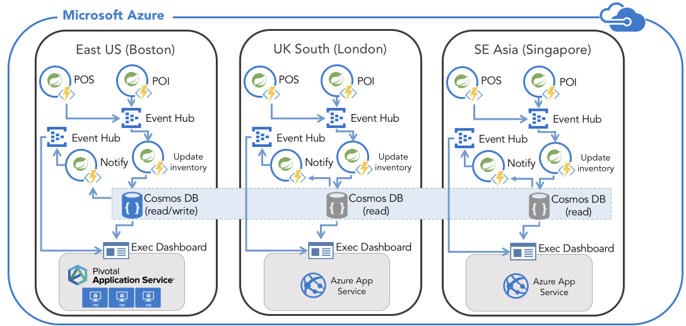

# Inventory Hub App using Java on Azure #

The purpose of this sample application is to illustrate building responsive systems with serverless, event-driven Java on Azure; the result of this project will be to create a real-time inventory hub.

## Requirements ##

In order to create and deploy this sample application, you need to have the following:

An Azure subscription; if you don't already have an Azure subscription, you can activate your [MSDN subscriber benefits](https://azure.microsoft.com/pricing/member-offers/msdn-benefits-details/) or sign up for a [free Azure account](https://azure.microsoft.com/pricing/free-trial/).

In addition, you will need all of the following components before you go through the steps in this README:

| [Azure CLI](http://docs.microsoft.com/cli/azure/overview) | [Java 8](http://java.oracle.com/) | [Maven 3](http://maven.apache.org/) | [Git](https://github.com/) |

**NOTE**: There are additional requirements in the *[~/deployment/README.md](deployment/README.md)* file which are required in order to setup your development environment; other required components will be installed automatically by the provisioning scripts.

## Overview ##

In the following sections, you will create a development sandbox environment on Azure which uses the following components:

- Two [Event Hubs](https://azure.microsoft.com/en-us/services/event-hubs/) in one Event Hub Namespace per region
    - an event hub receives events from Point of Sale (POS) and Point of Intake (POI) units
    - an event hub receives events to notify any app that listens for inventory change
- One [Cosmos DB](https://azure.microsoft.com/en-us/services/cosmos-db/) configured for "read/write" in the first region and "read" for additional regions
- Set of [Azure Functions](https://azure.microsoft.com/en-us/services/functions/) apps per region
    - One Point of Sale (POS) function app to simulate a terminal in a store, one per terminal
    - One Point of Intake (POI) function app to simulate a terminal in a warehose, one per terminal
    - One Update Inventory function app triggered by events produced by POS and POI units to update inventory 
    - One Notify function app triggered by updates to inventory
- One [Azure Web App](https://azure.microsoft.com/en-us/services/app-service/web/) per region or One [Pivotal Cloud Foundry instance on Azure](https://azuremarketplace.microsoft.com/en-us/marketplace/apps/pivotal.pivotal-cloud-foundry) per region

The following diagram illustrates the full topology for this sample application enviroment:

   

## Create and Deploy the Inventory Hub ##

<a name="create-the-initial-build"></a>
### Create the initial build ###

1. Open a command prompt and navigate to the *~/deployment/* folder of your local repo.

```shell
   cd deployment
   ```

1. Login to your Azure account and specify which subscription to use:

   ```shell
   az login
   az account set --subscription "<your-azure-subscription>"
   ```

   **NOTE**: You can use either a subscription name or id when specifying which subscription to use; to obtain a list of your subscriptions, type `az account list`.

1. Build an initial layout on Azure using ARM templates as described in the [README](./deployment)

### Deploy Inventory Processor

1. Deploy Update Product Inventory function app as described in the [README](./function-apps/Update-Product-Inventory)
2. Deploy Append Transactions function app as described in the [README](./function-apps/Append-Transaction)

### Deploy Inventory Dashbaord Web App

1. Deploy Inventory Dashboard Web app as described in [README](./dashboard-web-app)

### Deploy POI and POS Terminals as Azure Function Apps

1. Deploy Point of Inventory terminal as function app as described in [README](./Point-Of-Transaction#POI). Deploy one per terminal. If you were to imagine 4 terminals then you would deploy 4 similar function apps
2. Deploy Point of Sale terminal as function app as described in [README](./Point-of-Transaction#POS). Deploy one per terminal. If you were to imagine 4 terminals then you would deploy 4 similar function apps

### Open the Inventory Hub Web App

Open the Inventory Hub Web app ...

# Contributing

This project welcomes contributions and suggestions.  Most contributions require you to agree to a
Contributor License Agreement (CLA) declaring that you have the right to, and actually do, grant us
the rights to use your contribution. For details, visit https://cla.microsoft.com.

When you submit a pull request, a CLA-bot will automatically determine whether you need to provide
a CLA and decorate the PR appropriately (e.g., label, comment). Simply follow the instructions
provided by the bot. You will only need to do this once across all repos using our CLA.

This project has adopted the [Microsoft Open Source Code of Conduct](https://opensource.microsoft.com/codeofconduct/).
For more information see the [Code of Conduct FAQ](https://opensource.microsoft.com/codeofconduct/faq/) or
contact [opencode@microsoft.com](mailto:opencode@microsoft.com) with any additional questions or comments.
