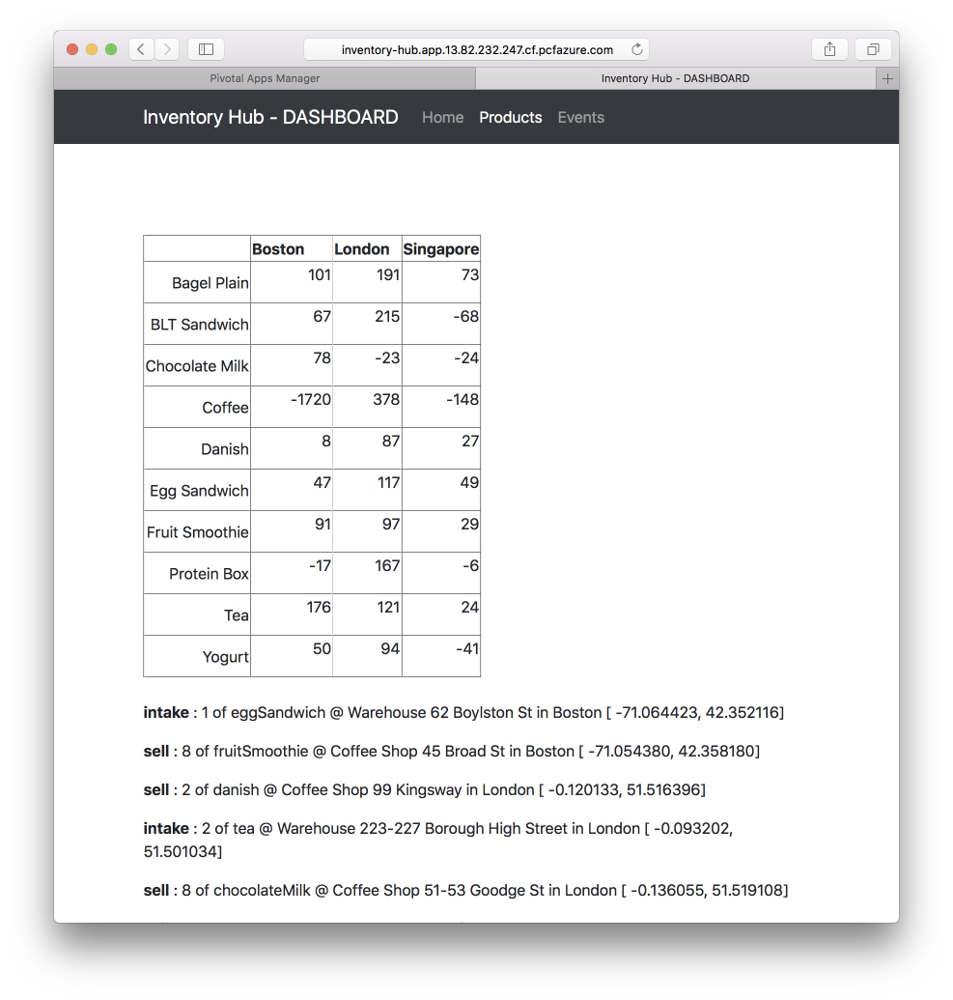
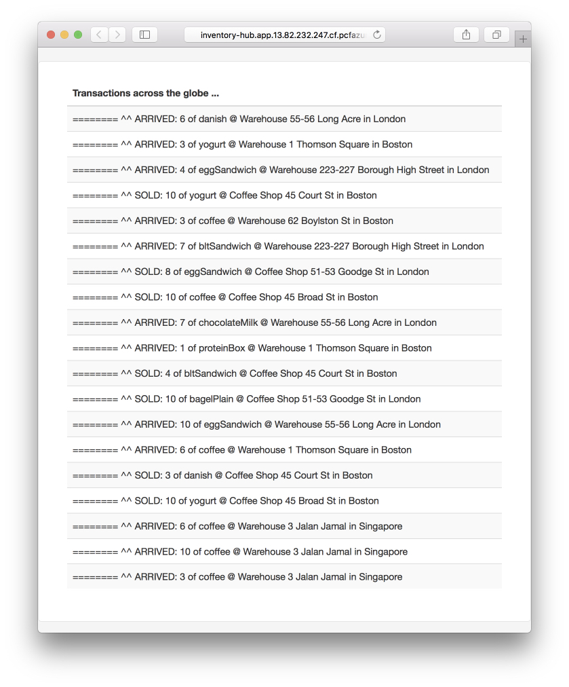
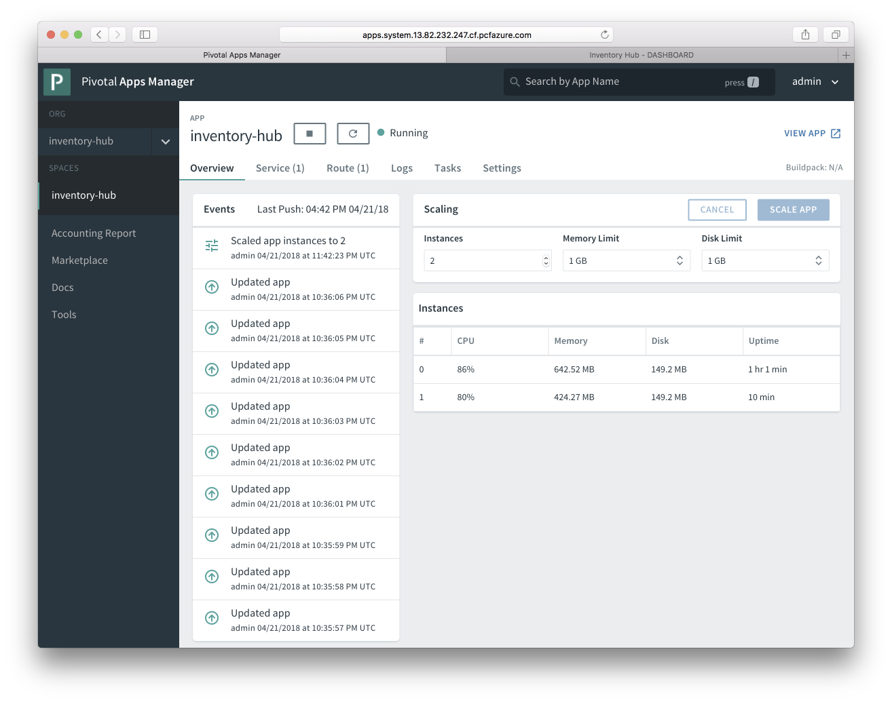

# Deploy Inventory Hub Java Web App =TO=> Pivotal Cloud Foundry on Azure

This Inventory Hub app is a Java application. It display product
inventory using AngularJS code. 
Behind the scene, the inventory data store 
is [Azure CosmosDB DocumentDB](https://docs.microsoft.com/en-us/azure/cosmos-db/documentdb-introduction). 
This application uses [Azure CosmosDB DocumentDB Spring Boot Starter](https://github.com/Microsoft/azure-spring-boot/tree/master/azure-starters/azure-documentdb-spring-boot-starter) 
and AngularJS to interact with Azure. This sample application 
provides several deployment options to deploy to Azure, pls 
see deployment section below. With Azure support in Spring 
Starters, maven plugins and Eclipse / IntelliJ plugins, 
Java application development and deployment on Azure
are effortless now.


## TOC

* [Requirements](#requirements)
* [Create Azure Cosmos DB and Event Hub](#create-azure-cosmos-db-and-event-hub)
* [Configuration](#configuration)
* [Build](#build-inventory-hub-web-app---jar)
* [Run Locally](#run-it-locally---optional-step)
* [Deploy to Pivotal Cloud Foundry on Azure](#deploy-to-pivotal-cloud-foundry-on-azure)

## Requirements

* [JDK](http://www.oracle.com/technetwork/java/javase/downloads/jdk8-downloads-2133151.html) 1.8 and above
* [Maven](https://maven.apache.org/) 3.0 and above
* [Cloud Foundry CLI](https://docs.cloudfoundry.org/cf-cli/install-go-cli.html)

## Create Azure Cosmos DB and Event Hub

You can follow steps described in the [deployment folder][../deployment/README.md].

## Configuration

Note down your DocumentDB uri and key from last step, 
specify a database name but no need to create it.

Set these values in ./push-cf-env.sh:

``` bash
# Setup Cloud Foundry Environment Variables for Inventory Hub
# Insert environment values and run source push-cf-env.sh

cf set-env inventory-hub  DOCUMENTDB_URI put-your-documentdb-uri-here
cf set-env inventory-hub DOCUMENTDB_KEY put-your-documentdb-key-here
cf set-env inventory-hub DOCUMENTDB_DBNAME put-your-documentdb-databasename-here

cf set-env inventory-hub NOTIFICATIONS_EVENT_HUB_NAME put-your-eventhub-for-notifications
cf set-env inventory-hub NOTIFICATIONS_EVENT_HUB_CONSUMER_GROUP_NAME put-your-eventhub-consumer-group-for-notifications 
cf set-env inventory-hub NOTIFICATIONS_EVENT_HUB_CONNECTION_STRING put-your-event-hub-connection-string
cf set-env inventory-hub NOTIFICATIONS_STORAGE_CONTAINER_NAME put-your-storage-container-name
cf set-env inventory-hub NOTIFICATIONS_STORAGE_CONNECTION_STRING put-your-storage-connection-string
```

## Build Inventory Hub Web App - JAR

```bash
mvn clean package
```

## Run it locally - OPTIONAL STEP

Run the Inventory Hub app locally.

```bash
mvn spring-boot:run
```

Open `http://localhost:8080/` you can see the Inventory Hub app

## Deploy to Pivotal Cloud Foundry on Azure

### Deploy and Configure Pivotal Cloud Foundry on Azure

Enterprise deployments of Cloud Foundry typically comprise many VMs and are shared across multiple users, and
setting one up from scratch is outside the scope of this tutorial.  If you have a deployment available to you
already, you will probably prefer to use it instead of creating a new one.  However, if you don't have a 
deployment already or want to start from scratch, you can find choices, instructions, and more information 
[here](https://docs.microsoft.com/en-us/azure/cloudfoundry/).


To proceed, you will need to know the FQDN of your Cloud Foundry API.  For example, it may look like this:

```bash
api.system.<IP address>.cf.pcfazure.com 
```

1. To deploy the app to Cloud Foundry, you will need a user account, an org and space, and the SpaceDeveloper
role for the space assigned to the user.  If you already have these, [skip to the next step](#deploy-broker).
Otherwise, login as an admin and satisfy these prerequisites as follows:
    
   ```bash
   cf login -a <api-fqdn> --skip-ssl-validation
   cf create-user <user> <password>
   cf create-org <org>
   cf create-space <space> -o <org>
   cf set-space-role <user> <org> <space> SpaceDeveloper
   ```

2. Temporarly, to avoid a null pointer exception at startup time ... create an 'empty' service

If you last logged in as an admin, for example to execute the steps above, log in to Cloud Foundry with the
credentials that have the SpaceDeveloper role for the space you're going to use.

```bash
cf login -a <api-fqdn> --skip-ssl-validation

cf create-user-provided-service empty
```

### Now, Deploy to Pivotal Cloud Foundry on Azure

Deploy in one step. You can continue to deploy again and 
again without restarting Tomcat.

```bash
cf push inventory-hub --no-start

source push-cf-env.sh

cf start inventory-hub
```

```bash
...
...
Waiting for app to start...

name:              inventory-hub
requested state:   started
instances:         2/2
usage:             1G x 2 instances
routes:            inventory-hub.app.13.82.232.247.cf.pcfazure.com
last uploaded:     Sat 21 Apr 15:55:54 PDT 2018
stack:             cflinuxfs2
buildpack:         client-certificate-mapper=1.2.0_RELEASE
                   container-security-provider=1.8.0_RELEASE
                   java-buildpack=v4.5-offline-https://github.com/cloudfoundry/java-buildpack.git#ffeefb9
                   java-main java-opts jvmkill-agent=1.10.0_RELEASE
                   open-jdk-like-jre=1.8.0_1...
start command:     JAVA_OPTS="-agentpath:$PWD/.java-buildpack/open_jdk_jre/bin/jvmkill-1.10.0_RELEASE=printHeapHistogram=1
                   -Djava.io.tmpdir=$TMPDIR
                   -Djava.ext.dirs=$PWD/.java-buildpack/container_security_provider:$PWD/.java-buildpack/open_jdk_jre/lib/ext
                   -Djava.security.properties=$PWD/.java-buildpack/security_providers/java.security
                   $JAVA_OPTS" &&
                   CALCULATED_MEMORY=$($PWD/.java-buildpack/open_jdk_jre/bin/java-buildpack-memory-calculator-3.9.0_RELEASE
                   -totMemory=$MEMORY_LIMIT -stackThreads=300
                   -loadedClasses=15771 -poolType=metaspace
                   -vmOptions="$JAVA_OPTS") && echo JVM Memory Configuration:
                   $CALCULATED_MEMORY && JAVA_OPTS="$JAVA_OPTS
                   $CALCULATED_MEMORY" && SERVER_PORT=$PORT eval exec
                   $PWD/.java-buildpack/open_jdk_jre/bin/java $JAVA_OPTS -cp
                   $PWD/. org.springframework.boot.loader.JarLauncher

     state     since                  cpu    memory         disk           details
#0   running   2018-04-21T22:57:24Z   0.0%   316.8M of 1G   150.6M of 1G   
#1   running   2018-04-21T22:57:25Z   0.0%   333.2M of 1G   150.6M of 1G 
```

### Open the Inventory Hub Web app

Open it in a browser







## Clean up

Delete the Azure resources you created by running the following command:

```bash
az group delete -y --no-wait -n <your-resource-group-name>
```


